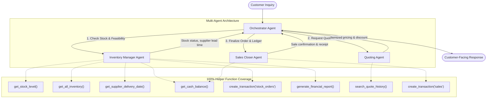

# The Beaver's Choice Paper Company - Workflow & Agent Specifications

## 1. System Overview

This specification details the agent hierarchy, communication contracts, tool interfaces, and prompt strategies for the 4-agent system powering The Beaver's Choice Paper Company.

---

## 2. Detailed Agent Specifications

### 2.1 Orchestrator Agent
- **Description**: The primary coordinator that receives incoming inquiries, invokes specialized worker agents, evaluates fulfillment criteria, and formulates final customer communications.
- **System Prompt Objectives**:
  - Extract the customer's requested items, quantities, inquiry date, and required delivery date.
  - Coordinate sequential calls: First verify inventory with the Inventory Manager. If stock/supplier timeline permits, obtain quote from the Quoter. If approved, direct the Sales Closer to execute the order.
  - If delivery is impossible or items cannot be supplied, issue a polite and transparent rejection explaining the specific constraint (e.g., supplier delivery date exceeds requested deadline).
  - Adhere to customer privacy and internal confidential metrics protection: never expose internal wholesale unit costs, profit margins, or internal database primary keys.

### 2.2 Inventory Manager Agent
- **Description**: Specialist in warehouse stock levels, supplier lead times, and inventory valuation.
- **Assigned Tools**:
  1. `check_stock_level(item_name: str, as_of_date: str)`: Calls `get_stock_level`.
  2. `get_inventory_snapshot(as_of_date: str)`: Calls `get_all_inventory`.
  3. `estimate_supplier_delivery(input_date_str: str, quantity: int)`: Calls `get_supplier_delivery_date`.
  4. `check_cash_for_restock(as_of_date: str)`: Calls `get_cash_balance`.
  5. `order_supplier_restock(item_name: str, quantity: int, price: float, date: str)`: Calls `create_transaction` with `'stock_orders'`.
  6. `get_financial_report(as_of_date: str)`: Calls `generate_financial_report`.

### 2.3 Quoting Agent
- **Description**: Specialist in competitive paper pricing, bulk discount structures, and historical quote comparisons.
- **Assigned Tools**:
  1. `search_quote_history(search_terms: list[str], limit: int)`: Calls `search_quote_history` to inspect past quote explanations and pricing patterns.
  2. `calculate_quote_price(item_name: str, quantity: int, customer_type: str, event_type: str)`: Calculates unit price, tier discount, and total quote.
- **Pricing Strategy**:
  - Catalog base unit prices from `paper_supplies`.
  - Volume Discounts:
    - Standard (<200 units): 0% discount.
    - Medium tier (200 - 999 units): 5% discount.
    - Large tier (1,000 - 4,999 units): 10% discount.
    - Enterprise tier (>=5,000 units): 15% discount.

### 2.4 Sales Closer Agent
- **Description**: Specialist in transaction execution, order booking, and ledger consistency.
- **Assigned Tools**:
  1. `record_sales_transaction(item_name: str, quantity: int, price: float, date: str)`: Calls `create_transaction` with `'sales'`.
  2. `verify_cash_balance(as_of_date: str)`: Calls `get_cash_balance` to verify ledger update post-sale.

---

## 3. Communication & State Flow

1. **Request Intake**: Incoming tuple `(job, need_size, event, request, request_date)` from `quote_requests_sample.csv`.
2. **Analysis**: Orchestrator parses items and dates.
3. **Inventory Assessment**:
   - For each requested item:
     - Check current stock as of `request_date`.
     - If `stock >= requested_qty`, condition is `IN_STOCK`.
     - If `stock < requested_qty`, calculate supplier arrival date via `get_supplier_delivery_date(request_date, deficit_qty)`.
     - Compare supplier arrival date with customer's requested delivery date.
4. **Fulfillment Decision**:
   - **Branch A (Fulfill)**: All items are either in stock or restockable before customer deadline.
     - Obtain quote from Quoting Agent.
     - Execute transaction via Sales Closer Agent.
     - Return congratulatory quote confirmation with delivery date.
   - **Branch B (Reject)**: One or more items cannot arrive before customer deadline or are invalid catalog items.
     - Return detailed explanation indicating earliest available delivery date or unfulfillable items.
5. **Ledger Update & Tracking**:
   - System records `cash_balance` and `inventory_value` using `generate_financial_report`.
   - Results appended to `test_results.csv`.
