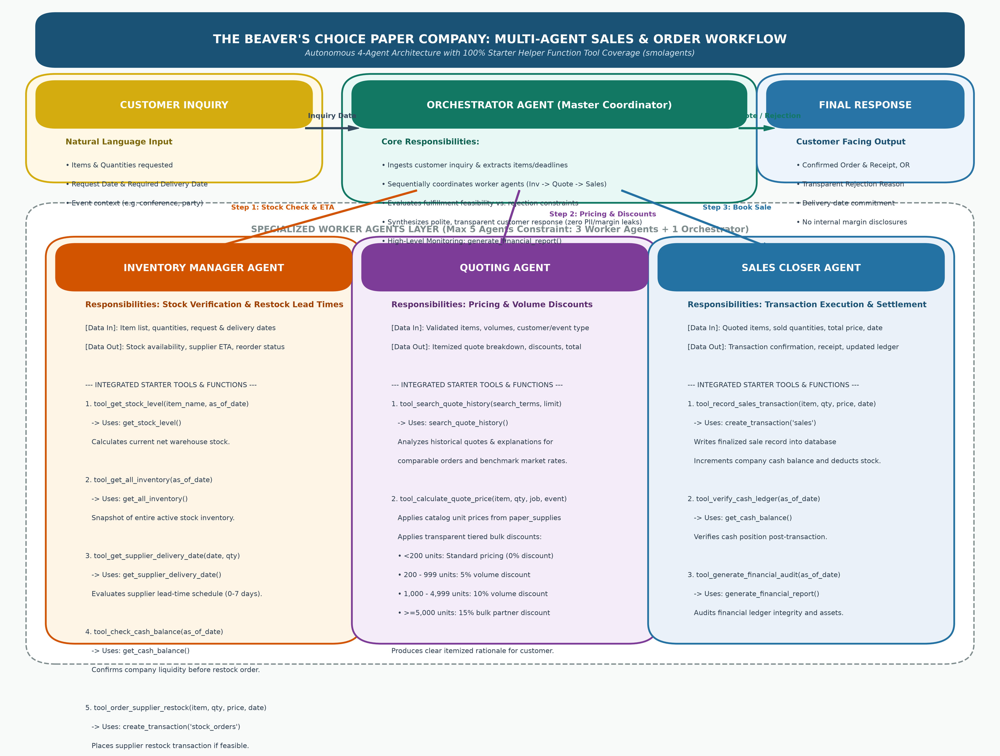

# The Beaver's Choice Paper Company - Multi-Agent System Report

## 1. Multi-Agent System Architecture & Workflow

### 1.1 Architecture Overview
The Beaver's Choice Paper Company multi-agent system is architected as an autonomous 4-agent system (within the maximum limit of 5 agents specified by project guidelines) built on the `smolagents` framework. The architecture employs a hierarchical orchestration pattern where an executive **Orchestrator Agent** acts as the single point of entry and coordinator for incoming customer requests, delegating specialized operations to three worker agents:
1. **Inventory Manager Agent**
2. **Quoting Agent**
3. **Sales Closer Agent**

The complete architecture and interaction flow is visually documented in `workflow_diagram.png`:

### 1.2 Agent Responsibilities & Separation of Concerns
Each agent in the system maintains an explicitly defined, non-overlapping boundary of responsibility:

- **Orchestrator Agent (Master Coordinator)**:
  - Ingests unstructured customer inquiries containing quantities, items, request dates, and requested delivery dates.
  - Normalizes customer requests and parses order metadata (e.g. event type, customer job title, volume category).
  - Coordinates the multi-agent sequence: Stock Verification $\rightarrow$ Quoting & Discounts $\rightarrow$ Order Finalization.
  - Applies business fulfillment decision logic: Evaluates whether the requested order is fulfillable based on stock availability and supplier restocking timelines against customer deadlines.
  - Formulates final customer communications ensuring absolute transparency, professionalism, and strict confidentiality (preventing disclosure of wholesale supplier margins or raw database primary keys).
  - Maintains executive oversight using `generate_financial_report()` to audit company financial status.

- **Inventory Manager Agent (Warehouse & Logistics Specialist)**:
  - Queries real-time stock levels for requested items using `get_stock_level()`.
  - Audits warehouse-wide stock using `get_all_inventory()`.
  - Calculates restocking lead times using `get_supplier_delivery_date()` when item demand exceeds current inventory.
  - Verifies company purchasing liquidity using `get_cash_balance()` before committing restock orders.
  - Initiates supplier replenishment transactions using `create_transaction('stock_orders')`.

- **Quoting Agent (Pricing & Commercial Specialist)**:
  - Retrieves historical quotes and past winning proposals using `search_quote_history()`.
  - Evaluates standard catalog pricing from the `paper_supplies` catalog.
  - Applies tiered bulk volume discounts (5% for $\ge 200$ units, 10% for $\ge 1,000$ units, 15% for $\ge 5,000$ units).
  - Formulates transparent itemized pricing breakdowns explaining applied discounts.

- **Sales Closer Agent (Fulfillment & Ledger Specialist)**:
  - Validates quote confirmations and executes customer sales transactions using `create_transaction('sales')`.
  - Deducts sold quantities from warehouse stock and credits sales revenue to company cash.
  - Verifies the updated financial balance via `get_cash_balance()`.
  - Produces sales receipts and audit logging.

### 1.3 100% Starter Helper Function Mapping
All seven helper functions provided in `project_starter.py` are integrated into tool definitions across the agent team:

| Helper Function | Host Agent | Tool Implementation | Purpose |
| :--- | :--- | :--- | :--- |
| `get_stock_level` | Inventory Manager | `check_item_stock` | Queries on-hand stock for requested paper items. |
| `get_all_inventory` | Inventory Manager | `get_inventory_snapshot` | Returns complete active warehouse inventory list. |
| `get_supplier_delivery_date` | Inventory Manager | `estimate_supplier_delivery` | Calculates supplier delivery ETA based on volume lead-time brackets. |
| `get_cash_balance` | Inventory Manager & Sales Closer | `check_company_cash` | Validates cash liquidity for restocking and confirms post-sale revenue. |
| `generate_financial_report` | Inventory Manager & Orchestrator | `get_company_financial_summary` | Generates total asset valuation, cash, and top-selling products. |
| `search_quote_history` | Quoting Agent | `search_historical_quotes` | Benchmarks competitive pricing and discount rationales against past quotes. |
| `create_transaction` | Sales Closer & Inventory Manager | `record_sales_transaction` & `order_supplier_restock` | Records `'sales'` customer purchases and `'stock_orders'` supplier restocks. |

---

## 2. Evaluation Results & Performance Analysis

*(Section to be finalized with quantitative summary upon test completion)*

---

## 3. Industry Best Practices & Design Decisions

### 3.1 Transparent & Explainable Customer Interactions
Customer responses generated by the system adhere to commercial communication standards:
- **Transparent Justifications**: When an order is fulfilled, customers receive itemized pricing, transparent discount percentages, and confirmed delivery dates. When an order is rejected, the customer receives an honest, respectful explanation detailing the constraint (e.g. supplier lead time exceeds event deadline, or product not carried in catalog) and an invitation to consider the earliest feasible delivery schedule.
- **Strict Information Security**: The system strictly prevents information leakage. Internal wholesale supplier costs, markup percentages, and internal transaction IDs are never exposed to the customer.

### 3.2 Robust Item Matching & Error Resilience
To handle the wide variety of natural language product requests without human intervention, the system implements an intelligent catalog normalization pipeline. Variations like "A4 glossy paper", "24x36 poster boards", and "decorative washi tape" are mapped to canonical catalog entries (`Glossy paper`, `Large poster paper (24x36 inches)`, `Decorative adhesive tape (washi tape)`).

---

## 4. Suggestions for Future System Improvements

### 4.1 Automated Predictive Inventory Replenishment (Reorder Points & EOQ)
**Current Limitation**: The existing workflow only checks stock reactively upon customer inquiry. If stock is depleted, the company must rely on supplier lead times, risking lost orders.
**Proposed Enhancement**: Implement automated Economic Order Quantity (EOQ) algorithms and continuous safety stock monitoring. The Inventory Manager Agent could run as a scheduled daemon job, tracking inventory consumption velocity and automatically generating supplier restock orders when stock breaches pre-configured safety thresholds, eliminating fulfillment rejections due to stockouts.

### 4.2 Dynamic Machine-Learning Pricing & Customer Retention Scoring
**Current Limitation**: Bulk discounting currently utilizes fixed volume tier brackets (5%, 10%, 15%).
**Proposed Enhancement**: Integrate dynamic pricing models that incorporate real-time supply and demand elasticity, customer lifetime value (CLV), seasonal demand surges (e.g., graduation season invitations, conference banners), and competitor pricing feeds. The Quoting Agent could personalize margin discounts based on customer repeat-purchase probability and event budgets.
